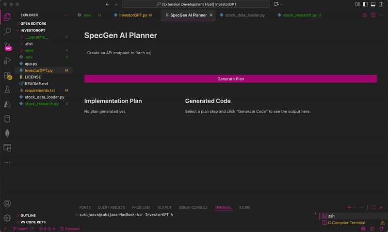

# SpecGen - Your AI Tech Lead 

**SpecGen** is a VS Code extension that reimagines how you interact with AI for coding. Instead of just asking for a snippet, you give it a high-level goal, and it acts like an expert software architect—breaking down the task into a concrete, file-by-file implementation plan right inside your IDE.

It's a simplified take on the "planning layer" concept, built to demonstrate a more structured and reliable way to use AI for complex code changes.

---

### **See It in Action!**




---

## What Makes SpecGen Different?

Tired of AI assistants that give you one giant, out-of-context code block? SpecGen works like a real tech lead:

1.  **You give it an idea** (e.g., "Add a new Redux slice for user authentication").
2.  **It creates a plan,** figuring out which files to create or modify.
3.  **You review the plan** and then ask it to write the code for each step, one by one.

This gives you full control and ensures the AI has the right context for every single change.

---

## Core Features

* **✨ AI-Powered Project Planning:** Takes a high-level feature request and intelligently breaks it down into a structured, multi-file plan.
* **📝 Step-by-Step Code Generation:** Interactively generate the code for each step of the plan, giving you granular control.
* **📂 Direct File System Integration:** Apply the generated code directly to your workspace files with a single click.
* **🚀 Powered by Groq:** Utilizes the blazing-fast Groq API for near-instantaneous AI responses, using a 100% free model.

* **💻 Native VS Code Experience:** A beautiful and responsive user interface built with React and the VS Code Webview UI Toolkit for a seamless, integrated feel.

---

## Tech Stack

This project was built with a modern, professional toolchain:

* **Language:** TypeScript
* **Platform:** VS Code Extension API
* **AI Backend:** Groq API (using the `gemma2-9b-it` model)
* **UI:** React, VS Code Webview UI Toolkit
* **Bundler:** Webpack
* **API Client:** OpenAI Node.js Library

---

## Getting Started (Running Locally)

To get this project running on your own machine, follow these steps.

#### 1. Get a Free Groq API Key
This project runs on the Groq API, which is completely free and doesn't require a credit card.

* Sign up for a free account at [Groq](https://console.groq.com/).
* Go to the **API Keys** section and create a new key.
* Copy your key.

#### 2. Set Up the Project
```bash
# Clone this repository to your local machine
git clone [https://github.com/your-username/specgen.git](https://github.com/your-username/specgen.git)

# Navigate into the project folder
cd specgen
```
#### 3. Configure Your API Key
In the root of the project, create a new file named .env. Add your Groq API key to it like this:
```bash
GROQ_API_KEY=gsk_YourCopiedApiKeyHere
```
#### 4. Install Dependencies
You'll need to install packages for both the main extension and the React UI.

```bash

# Install packages for the main extension
npm install

# Go into the UI folder and install its packages
cd webview-ui
npm install
```
#### 5. Build and Run
1. Build the UI: While still in the webview-ui folder, run the build command:

```bash

npm run build
```
2. Launch the Extension: Go back to the root folder (cd ..), open the project in VS Code, and press F5.

3. A new "Extension Development Host" window will open. In this new window, open any project folder you want to work on.

4. Open the Command Palette (Cmd+Shift+P or Ctrl+Shift+P) and run SpecGen: Start. The panel will appear, and you're ready to go!